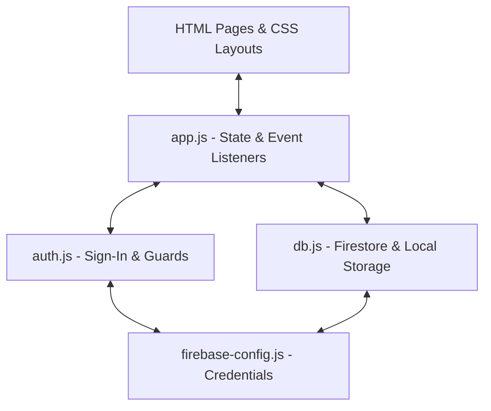

# ProgressShelf Developer & Project Report 📊

This report serves as a detailed documentation of the **ProgressShelf** application development history, codebase architecture, and implementation details. It is designed to help you explain how the application works, the features you built, and the security/architectural decisions made along the way.

---

## 📅 Project Journey: From v1.0 to v2.0

### Phase 1: v1.0 (The Basic Sandbox)
* **Goal**: Create a simple progress bar tracker to avoid the complexity of spreadsheets.
* **Features Built**:
  - A clean landing page with Google Sign-in and Guest Mode options.
  - Basic dashboard rendering simple progress bars.
  - Multi-level inputs (e.g. tracking progress in Pages/Chapters or hours/minutes/seconds).
  - Sandbox mode enabling offline persistence using `localStorage`.

### Phase 2: v2.0 (The Smart Tracker Upgrade)
* **Goal**: Enhance the application with scheduling, deadlines, and a premium visual overhaul.
* **Features Added**:
  - **Deadlines**: The ability to bind target dates/times to your trackers.
  - **Live Overdue Counter**: Math functions to compute remaining or overdue time (excluding seconds for clean UX) and display it using live ticking timers (`Overdue by 2d 3hr`).
  - **UI Refinements**: Built a premium dark glassmorphic design, mobile-friendly navigation buttons, and responsive modal screens.
  - **Version Archiving**: Instead of overwriting the original work, v1.0 was fully archived into a standalone `/versions/v1.0/` directory structure, allowing users to switch between layouts on the fly.

---

## 🛠 Architectural Blueprint

The application follows a clean **Model-View-Controller (MVC) style** separation of concerns using ES Modules:

### 1. The Core Components
- **`firebase-config.js`**: Handles initialization. It checks if the setup exists, exporting a helper flag `isConfigured` so the code does not break if a user clones the project without setting up Firebase.
- **`auth.js`**: Manages auth routing. If a user is not authenticated and is not in guest mode, it automatically redirects them back to `index.html`.
- **`db.js`**: Simplifies CRUD database operations. It transparently swaps between Firestore (cloud database) and `localStorage` (local sandbox) based on config and session flags, so the rest of your app doesn't have to worry about where the data is stored.
- **`app.js`**: Binds database states to UI changes. Handles updating trackers, calculating remaining time percentages, rendering progress lines, and managing ticking intervals.

---

## 🔒 Security & Performance Considerations

1. **API Key Safety**:
   - `firebase-config.js` is excluded from git tracking using `.gitignore` to prevent private Firebase project keys from leaking online.
   - For public convenience, `firebase-config.template.js` is provided as a template.
2. **ES Module Imports**:
   - The application relies on CDN imports (`https://www.gstatic.com/firebasejs/9.23.0/...`) to fetch Firebase packages directly in the browser. This eliminates the need for build tools like Webpack or Vite, keeping deployment fast and simple.
3. **Data Security**:
   - Guest data is completely isolated in the user's browser client (`localStorage`), keeping it private.
   - Firebase data uses Firebase Security Rules to restrict document read/write access to the authenticated owner.

---

## 💡 Key Accomplishments to Share
When describing this project, here are the main milestones you achieved:
- **Created a modular, zero-build progressive web app**: Runs instantly on standard browsers and static hosting sites (like GitHub Pages) without needing compile steps.
- **Engineered an offline-to-online data sync migration flow**: Users starting without logging in don't lose their data—logging in later automatically migrates local sandbox data to the Cloud Firestore database.
- **Implemented live timezone-aware status checks**: Handles target dates, ticking intervals, and relative time expressions seamlessly.
