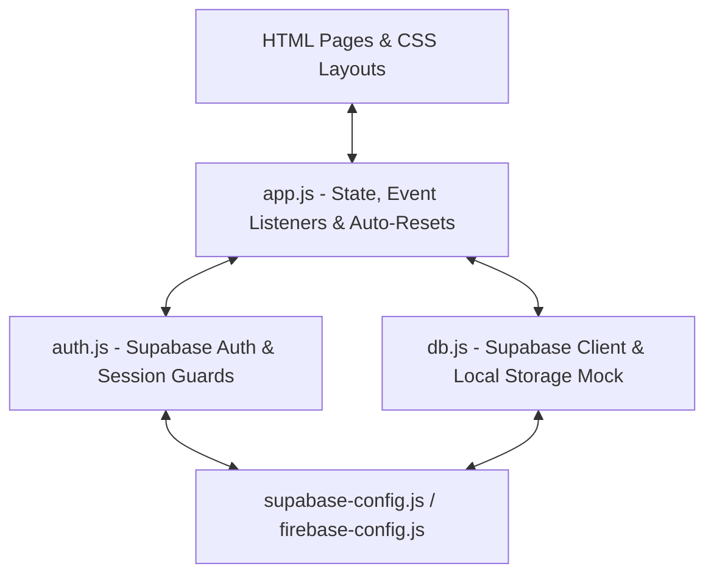

# ProgressShelf Developer & Project Report 📊

This report serves as a detailed documentation of the **ProgressShelf** application development history, codebase architecture, and implementation details. It is designed to help you explain how the application works, the features you built, and the security/architectural decisions made along the way.

---

## 📅 Project Journey: From v1.0 to v4.3

### Phase 1: v1.0 (The Basic Sandbox)
* **Goal**: Create a simple progress bar tracker to avoid the complexity of spreadsheets.
* **Features Built**:
  - A clean landing page with Google Sign-in and Guest Mode options.
  - Basic dashboard rendering simple progress bars.
  - Multi-level inputs (e.g. tracking progress in Pages/Chapters or hours/minutes/seconds).
  - Sandbox mode enabling offline persistence using `localStorage`.

### Phase 2: v2.0 (The Smart Tracker Upgrade)
* **Goal**: Enhance the application with scheduling, deadlines, and a premium visual overhaul.
* **Features Added**:
  - **Deadlines**: The ability to bind target dates/times to your trackers.
  - **Live Overdue Counter**: Math functions to compute remaining or overdue time and display it using live ticking timers (`Overdue by 2d 3hr`).
  - **UI Refinements**: Built a premium dark glassmorphic design, mobile-friendly navigation buttons, and responsive modal screens.
  - **Version Archiving**: Standalone `/versions/` directory structure for seamless backwards compatibility.

### Phase 3: v3.0 (Checklists, Notes & Stats)
* **Goal**: Expand tracking categories beyond numeric bars into checklists and free-form notes.
* **Features Added**:
  - **Multi-Type Cards**: Interactive checklists and collapsible rich markdown notes.
  - **Stats Banner & Filtering**: Dynamic status banner providing quick-filtering by active, overdue, flexible, or completed cards.
  - **Drain-Border SVG Animation**: Perimeter border ring visualizing time remaining with smooth color transitions.

### Phase 4: v4.0 to v4.3 (Supabase, Theming & Auto-Repeat System)
* **Goal**: Enterprise-grade database backend, deep custom theming, and automated recurring routines.
* **Features Added**:
  - **Supabase Backend**: Real-time Postgres synchronization and secure Row Level Security (RLS).
  - **Auto-Repeat & Reset System (v4.3)**: Automated daily resets for checklists and deadlines with custom reset times and cycle counts.
  - **Visual Cycle States**: *Pending Renewal* (amber pulsing ring for overdue tasks awaiting reset) and *Soft Reset* (sky blue steady indicator for completed habits).
  - **Dynamic Theming**: Cloud-synced custom accent palettes, smart HSL clamping, and 48px glassmorphic backdrops.

---

## 🛠 Architectural Blueprint

The application follows a clean **Model-View-Controller (MVC) style** separation of concerns using native ES Modules:

```mermaid
graph TD
    UI[HTML Pages & CSS Layouts] <--> Controller[app.js - State, Event Listeners & Auto-Resets]
    Controller <--> Auth[auth.js - Supabase Auth & Session Guards]
    Controller <--> DB[db.js - Supabase Client & Local Storage Mock]
    Auth <--> Config[supabase-config.js / firebase-config.js]
    DB <--> Config
```

### 1. The Core Components
- **`supabase-config.js` / `firebase-config.js`**: Handles credentials initialization with zero leaks (gitignored).
- **`auth.js`**: Manages authentication routing and session verification via Supabase GoTrue client.
- **`db.js`**: Unified abstraction layer seamlessly switching between Supabase Cloud and browser LocalStorage mock.
- **`app.js`**: Main DOM controller, scroll controllers, timer intervals, and auto-repeat cycle evaluations.

---

## 🔒 Security & Performance Considerations

1. **API Key Safety**:
   - Private keys reside in `.gitignore` files, protected against public commits.
   - GitHub Pages deployments utilize GitHub Repository Secrets to populate configurations safely in CI/CD.
2. **ES Module Architecture**:
   - Zero compile/build steps; runs natively in modern browsers with maximum loading speed.
3. **Data Security**:
   - Row Level Security (RLS) ensures each authenticated user strictly accesses their own rows.
   - Guest data remains completely isolated on the local client device.

---

## 💡 Key Accomplishments to Share
- **Zero-build progressive web app**: Fully offline-capable, responsive, and installable on Android, iOS, Windows, and macOS.
- **Intelligent Habit Auto-Resets**: Automates daily routines with distinct visual cycle states (Pending Renewal vs Soft Reset).
- **Offline-to-online auto migration**: Zero data loss when transitioning from Guest sandbox mode to authenticated accounts.
- **Live timezone-aware calculations**: Accurate down to the millisecond across global timezones.
