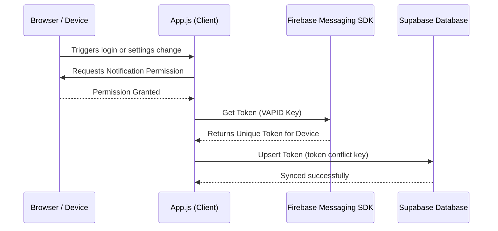
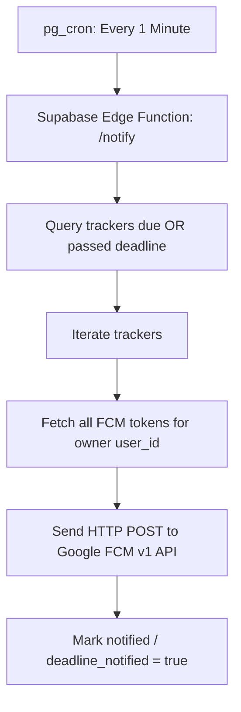

# ProgressShelf - FCM Push Notifications & Device Session Report

This report outlines how ProgressShelf captures device login sessions, manages push tokens, dispatches notifications via Supabase Edge Functions, and investigates potential causes for late or missing notifications.

---

## 1. Device Token Registration Flow (Client-Side)

Whenever a user signs in, creates a tracker, or enables notifications, the client captures and syncs the Firebase Cloud Messaging (FCM) tokens.



### Key Technical Details:
1.  **Unique Token Capture:** The Firebase Messaging SDK generates a unique token specific to the browser instance and physical device.
2.  **Multi-Device Mapping:** Tokens are saved inside the `fcm_tokens` table. The table conflict resolution (conflict key: `token`) maps multiple tokens to the same `user_id`:
    *   If a user logs in on a **Phone** and a **Laptop**, both devices generate separate FCM tokens and both are saved under their profile.
    *   If a new user logs into a browser that already had a token registered, the upsert query updates the `user_id` to point to the current logged-in user.

---

## 2. Notification Dispatching Flow (Server-Side)

Notifications are evaluated and sent using a Supabase Edge Function triggered by a background cron runner.



### Key Technical Details:
1.  **Trigger Interval:** A database cron job (`notify-deadlines` using `pg_cron`) calls the `/notify` edge function every **1 minute**.
2.  **Due Time Evaluation:**
    *   **Relative alerts** (e.g. 5 min before deadline) are queried using `notify_at <= now + 5 minutes`.
    *   **Exact deadline alerts** are queried using `deadline_at <= now`.
3.  **Authentication:** The edge function uses Google Auth to generate a secure short-lived Google OAuth2 access token via the Firebase Service Account key.
4.  **Multiplexed Dispatch:** The function retrieves all device tokens registered to the owner and issues concurrent POST requests to the FCM HTTP v1 API.

---

## 3. Why Notifications Might Be Delayed or Missing

If notifications are arriving late, clustering, or not arriving at all on some devices, the root causes usually fall into three categories:

### A. OS-Level Power Management and Sleep Throttling (Late Pushes)
*   **Background Suspension:** Modern mobile OS (Android, iOS) and laptops (macOS/Windows connected standby) put inactive browsers and PWAs to sleep to save battery.
*   **FCM Priority Queue:** FCM messages are currently dispatched as standard notifications. When a device is sleeping, FCM places them in a low-priority queue and delays delivery until the user wakes the device.
*   *Solution:* We can configure the FCM push request with high priority (`"android": { "priority": "high" }` and webpush headers) to wake up sleeping devices.

### B. Token Invalidation and Automatic Deletion (Missing Pushes)
*   **Stale Tokens:** Browsers invalidate VAPID push subscriptions if the user clears site data, revokes site permissions, or hasn't visited the site for several weeks.
*   **Edge Function Pruning:** When FCM returns an `UNREGISTERED` or `NotRegistered` status code, the Edge Function deletes that token row from the database. If a user's phone token is deleted, they will cease to get alerts until they re-open the app and sync a new token.

### C. Supabase Edge Function Cold Starts and Execution Limits
*   **Cold Starts:** Supabase Edge Functions on free tiers spin down when idle. The first cron run of the minute might experience a cold start latency of 3–5 seconds.
*   **10-Minute Stale Deadline Window:** To prevent flooding, the Edge Function marks trackers as notified but skips sending if a deadline is older than 10 minutes. If cold starts or cron runner delays exceed this window, notifications are intentionally skipped.

---

## 4. Recommendations for Next Upgrades

To maximize delivery rates and make notifications resilient, we recommend:

1.  **FCM High Priority Flag:** Force delivery on suspended devices by specifying high priority in the JSON payload:
    ```json
    "android": { "priority": "high" },
    "webpush": {
      "headers": { "Urgency": "high" }
    }
    ```
2.  **App Startup Token Sync Hook:** Automatically call `handleFCMSession(uid)` when the PWA is brought to the foreground to refresh stale tokens.
3.  **Active Service Worker Push Listener:** Enhance `sw.js` to parse push data payloads and display custom notifications manually using `self.registration.showNotification()`.
