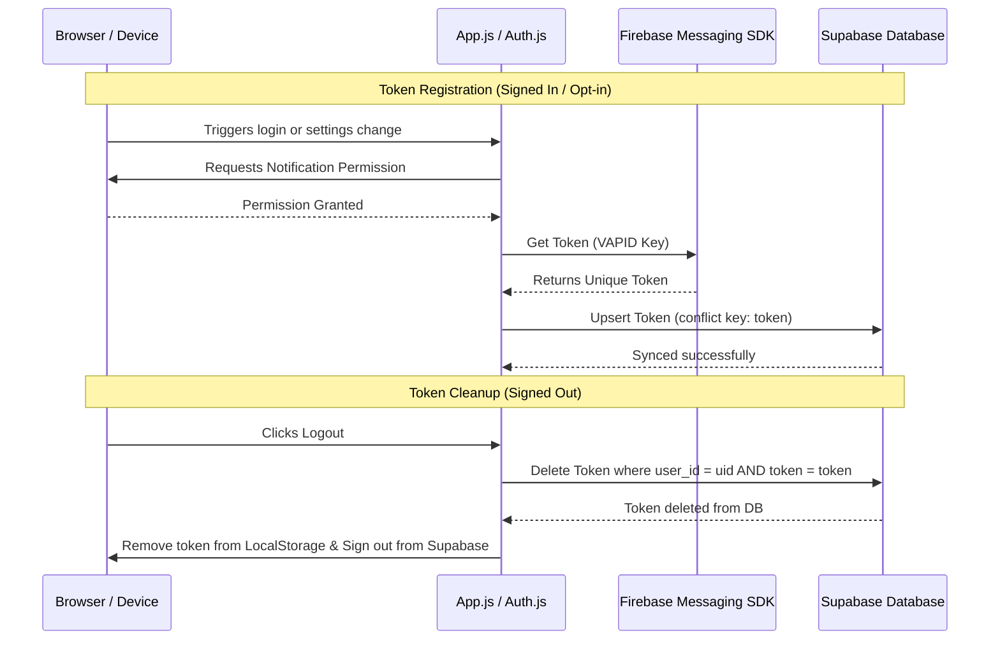
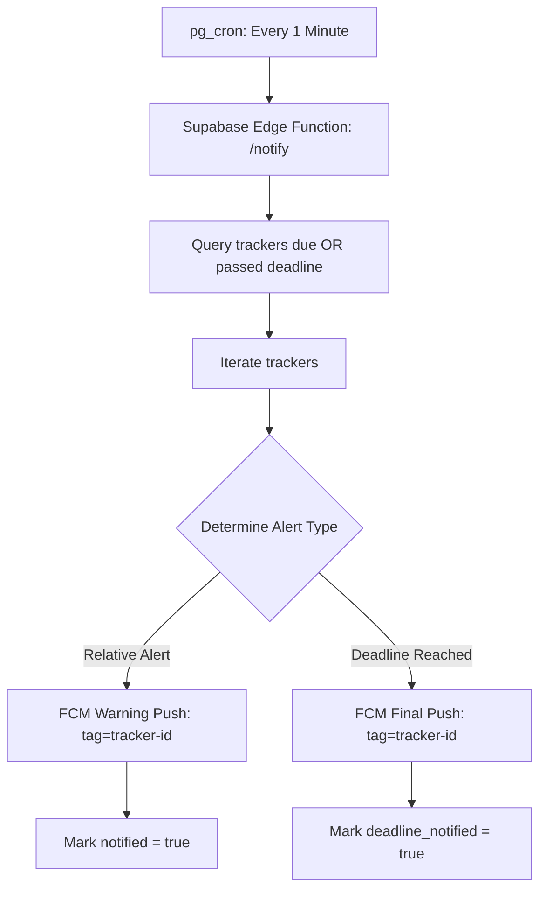

# ProgressShelf - FCM Push Notifications & Device Session Report

This report outlines how ProgressShelf captures device login sessions, manages push tokens, dispatches notifications via Supabase Edge Functions, and investigates potential causes for late or missing notifications.

---

## 1. Device Token Registration & Cleanup Flow (Client-Side)

Whenever a user signs in, creates a tracker, or enables notifications, the client captures and syncs the Firebase Cloud Messaging (FCM) tokens. Conversely, logging out triggers a clean token removal.

### Key Technical Details:
1.  **Unique Token Capture:** The Firebase Messaging SDK generates a unique token specific to the browser instance and physical device.
2.  **Multi-Device Mapping:** Tokens are saved inside the `fcm_tokens` table. The table conflict resolution (conflict key: `token`) maps multiple tokens to the same `user_id`:
    *   If a user logs in on a **Phone** and a **Laptop**, both devices generate separate FCM tokens and both are saved under their profile.
    *   If a new user logs into a browser that already had a token registered, the upsert query updates the `user_id` to point to the current logged-in user.
3.  **Signed-out Cleanup:** When logging out, `signOut()` is called inside `auth.js`. It fetches the current token from `localStorage` and deletes that specific row from the `fcm_tokens` table before purging `localStorage`. This prevents sending notifications to devices that are no longer authenticated.

---

## 2. Notification Dispatching Flow (Server-Side)

Notifications are evaluated and sent using a Supabase Edge Function triggered by a background cron runner.

### Key Technical Details:
1.  **Trigger Interval:** A database cron job (`notify-deadlines` using `pg_cron`) calls the `/notify` edge function every **1 minute**.
2.  **Due Time Evaluation:**
    *   **Relative warnings** (e.g. 5 min before deadline) are queried using `notify_at <= now + 5 minutes`.
    *   **Deadline reached warnings** (e.g. at the exact deadline) are queried using `deadline_at <= now` to prevent premature warning dispatches.
3.  **Authentication:** The edge function uses Google Auth to generate a secure short-lived Google OAuth2 access token via the Firebase Service Account key.
4.  **Multiplexed Dispatch:** The function retrieves all device tokens registered to the owner and issues concurrent POST requests to the FCM HTTP v1 API.

---

## 3. Why Notifications Might Be Delayed or Missing (Mitigations & Implementation)

If notifications are arriving late, clustering, or not arriving at all on some devices, the root causes usually fall into three categories:

### A. OS-Level Power Management and Sleep Throttling (Mitigated)
*   **Background Suspension:** Modern mobile OS (Android, iOS) and laptops (macOS/Windows connected standby) put inactive browsers and PWAs to sleep to save battery.
*   **FCM Priority Queue (Fixed):** FCM messages are now dispatched with high priority (`"android": { "priority": "high" }` and webpush headers `Urgency: "high"`). This wakes sleeping devices and ensures push notifications are treated as urgent by browsers.

### B. Token Invalidation and Automatic Deletion (Mitigated)
*   **Stale Tokens:** Browsers invalidate VAPID push subscriptions if the user clears site data, revokes site permissions, or hasn't visited the site for several weeks.
*   **Edge Function Pruning:** When FCM returns an `UNREGISTERED` status, the Edge Function deletes that token row.
*   **Foreground Re-sync Hook (Fixed):** We added a `visibilitychange` listener in `app.js`. Every time a user brings the PWA to the foreground, it silently runs a verification check (`handleFCMSession`) to refresh and sync the browser's FCM token, mitigating token drift.

### C. Supabase Edge Function Cold Starts and Execution Limits
*   **Cold Starts:** Supabase Edge Functions on free tiers spin down when idle. The first cron run of the minute might experience a cold start latency of 3–5 seconds.
*   **10-Minute Stale Deadline Window:** To prevent flooding, the Edge Function marks trackers as notified but skips sending if a deadline is older than 10 minutes. If cold starts or cron runner delays exceed this window, notifications are intentionally skipped.

---

## 4. Implemented Upgrades & Next Steps

We have successfully implemented the following upgrades to address notification reliability:

1.  **FCM High Priority:** Configured urgent headers in the HTTP v1 payload for immediate Android and WebPush wake-ups.
2.  **App Visibility Sync Hook:** Implemented token re-syncing on foreground visibility change inside `app.js`.
3.  **Service Worker Replacement Logic (`sw.js`):**
    *   Configured `tag` and `renotify: true` options to prevent alert stacks by replacing old notifications with new ones for the same tracker.
    *   Set `requireInteraction: false` to allow alerts to auto-dismiss on system timeout.
    *   Refocused the existing PWA browser tab upon notification click instead of opening duplicate tabs.
